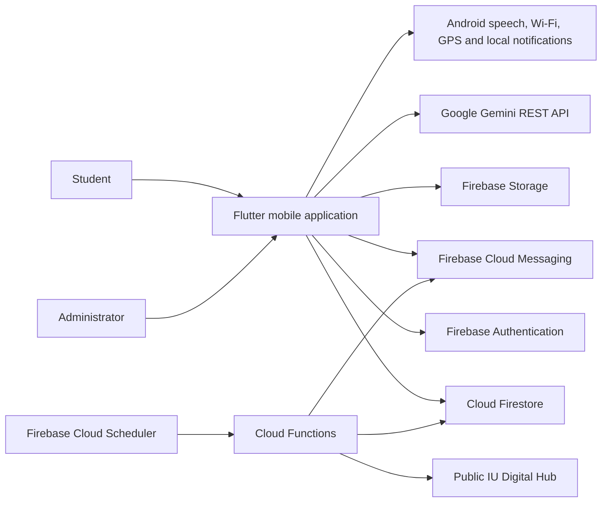
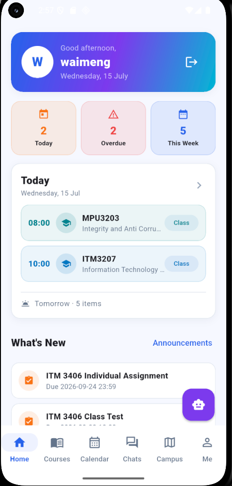
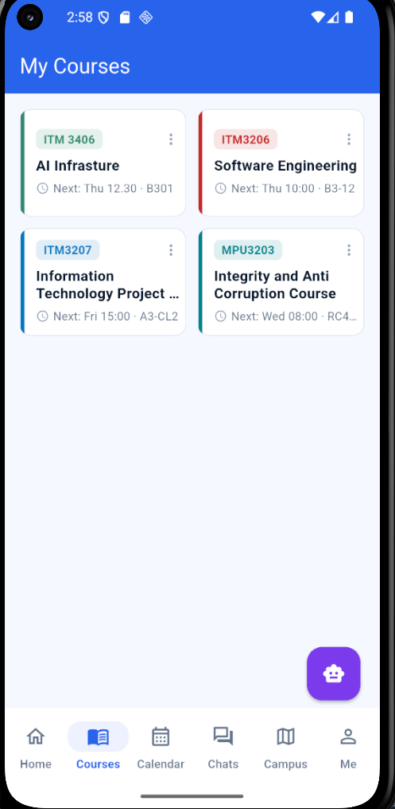
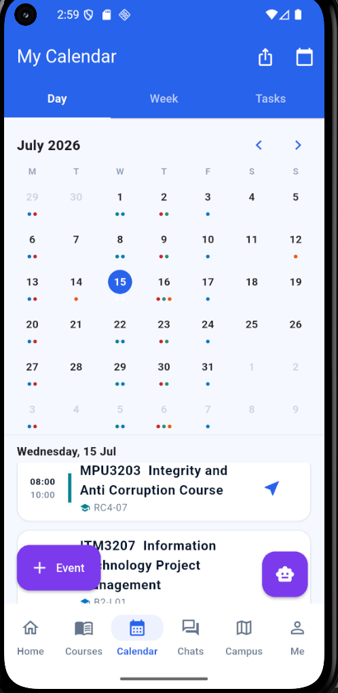
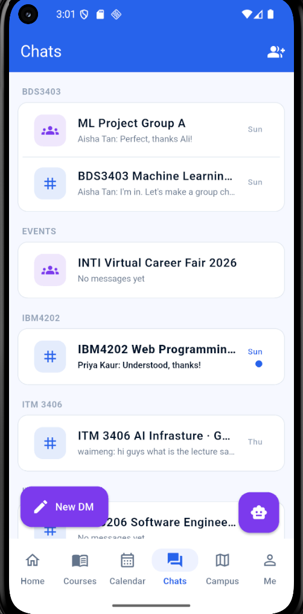
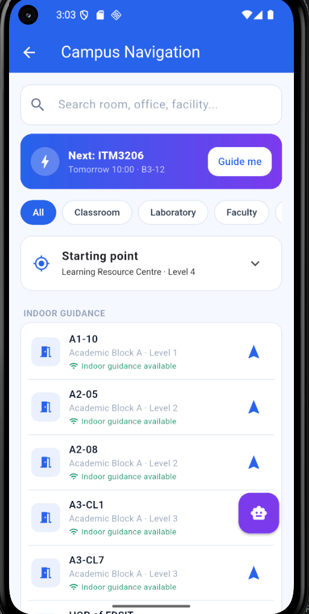
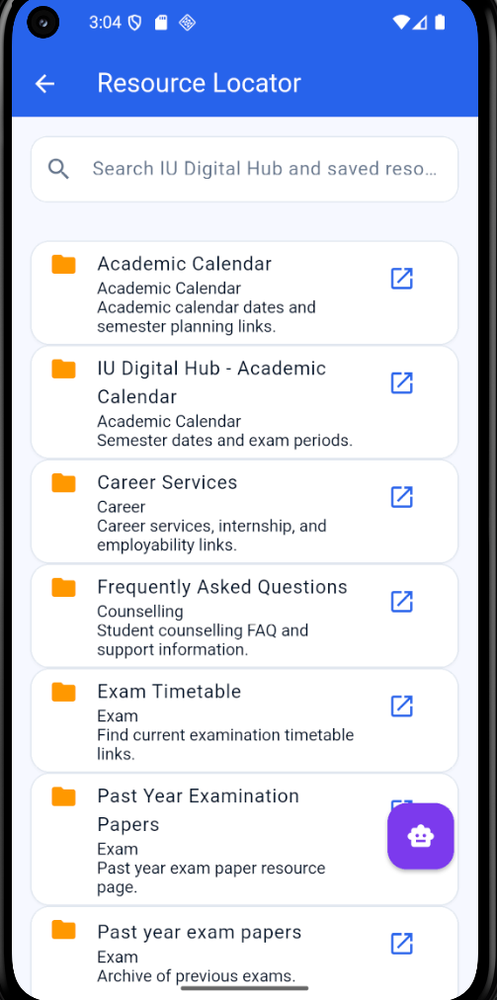
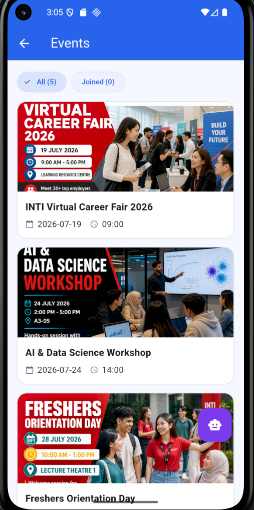
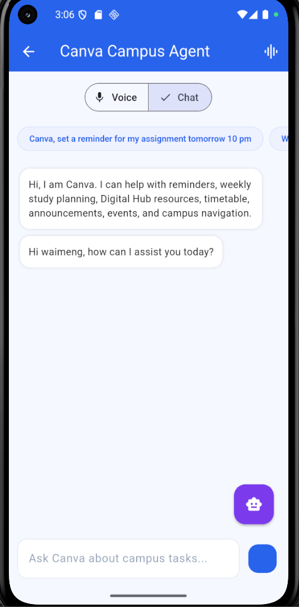
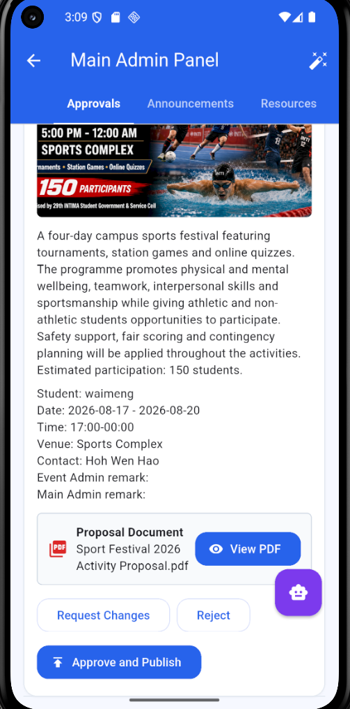

# AI Campus Companion

<div align="center">

**A centralised mobile companion for academic planning, campus services, communication and indoor navigation.**

Final Year Project | INTI International University


</div>

## Overview

AI Campus Companion brings frequently used student services into one Flutter application. Students can review classes and deadlines, communicate with coursemates, locate campus facilities, search IU Digital Hub resources, follow events and use the Canva Campus Agent through text or voice.

The project addresses the difficulty of switching between disconnected platforms such as Canvas, IU Digital Hub, email, messaging applications and university portals. It presents the most useful academic and campus information through a consistent mobile interface while keeping administrative actions role-protected.

> This is an independent academic prototype. It is not an official INTI application and is not affiliated with Canva.

## Contents

- [Key Features](#key-features)
- [Technical Highlights](#technical-highlights)
- [System Architecture](#system-architecture)
- [Application Screens](#application-screens)
- [Technology Stack](#technology-stack)
- [Getting Started](#getting-started)
- [Firebase and Demo Data](#firebase-and-demo-data)
- [Quick User Manual](#quick-user-manual)
- [Project Structure](#project-structure)
- [Testing](#testing)
- [Security Notes](#security-notes)
- [Current Limitations](#current-limitations)

## Key Features

### Student experience

| Area | Available functions |
| --- | --- |
| Account | Self-registration, INTI student email validation, email verification and secure login |
| Dashboard | Today's classes, overdue work, weekly workload, announcements and featured events |
| Courses | Course materials, announcements, due dates, schedules and academic information |
| Calendar | Day, week and task views with reminders, events and local notifications |
| Timetable | Manual entry or timetable image scanning with editable OCR results |
| Communication | Real-time course channels, project groups, direct messages, mentions, reactions and image sharing |
| Campus | Searchable campus locations and indoor guidance based on trained Wi-Fi fingerprints |
| Resources | Searchable IU Digital Hub and administrator-managed academic resources |
| Events | Event discovery, event chat and student proposal submission with PDF and poster uploads |
| AI assistant | Text and voice support for reminders, timetable queries, weekly planning, resources, events and navigation |
| Student record | GPA and CGPA tracking, result entry and result image scanning |
| Support | Notifications and structured feedback submission |

### Administrative experience

| Area | Available functions |
| --- | --- |
| Event review | Open proposal details, view the submitted PDF and poster, request changes, reject, approve and publish |
| Content management | Create, update and remove announcements, resources and campus locations |
| User management | Review users and assign student, event administrator or main administrator roles |
| Indoor training | Capture shared Wi-Fi samples, review trained locations and maintain campus coverage |
| Feedback | Review feedback submitted by students |

## Technical Highlights

### Canva Campus Agent

The assistant sends student requests to Google Gemini through a REST integration. Gemini is given a restricted campus-support prompt and a set of callable tools. A request such as "show my classes tomorrow" is routed to the timetable tool with the requested day, while "take me to A2-05" searches the campus data and can open navigation with the destination already selected.

Voice mode uses Android speech recognition through `speech_to_text` and reads replies with `flutter_tts`. Listening supports partial results, an eight-second speech pause and a maximum 45-second session. Students can also use the same assistant through normal text chat.

### Wi-Fi indoor positioning

Indoor GPS is often inaccurate, so administrators build a shared fingerprint map from nearby Wi-Fi access points and their RSSI signal strengths. Live positioning compares the current scan with stored samples using weighted k-nearest neighbours (`k = 5`). Distance is calculated from the root mean square difference between RSSI readings, including a penalty for missing access points.

The five closest samples vote by inverse distance. A short prediction window, confidence scoring and learned adjacency between nearby locations reduce sudden jumps between rooms or floors. Only trained destinations are presented as directly available for indoor guidance.

### Timetable and result scanning

Google ML Kit performs on-device Latin text recognition. The application then uses course-code, time, room, semester and grade patterns to produce editable timetable or result rows. The student reviews the detected information before saving it because OCR output can vary with image quality and timetable layout.

### IU Digital Hub synchronisation

A Firebase scheduled Cloud Function runs every three days at 02:00 in the `Asia/Kuala_Lumpur` timezone. Axios downloads the public IU Digital Hub page, Cheerio extracts links, duplicate entries are removed and the resulting resources are written to Firestore with their source and synchronisation time.

### Event proposal workflow

Students submit event information together with a required proposal PDF and an optional poster. Firebase Storage holds the files, while Firestore records the proposal and review status. Administrators can inspect the full evidence before requesting changes, rejecting the proposal, or approving and publishing the event.

## System Architecture



## Application Screens

<table>
  <tr>
    <td align="center"><br><b>Dashboard</b></td>
    <td align="center"><br><b>Courses</b></td>
    <td align="center"><br><b>Calendar</b></td>
  </tr>
  <tr>
    <td align="center"><br><b>Chats</b></td>
    <td align="center"><br><b>Navigation</b></td>
    <td align="center"><br><b>Resources</b></td>
  </tr>
  <tr>
    <td align="center"><br><b>Events</b></td>
    <td align="center"><br><b>Canva Agent</b></td>
    <td align="center"><br><b>Admin Panel</b></td>
  </tr>
</table>

## Technology Stack

| Layer | Technologies |
| --- | --- |
| Application | Flutter, Dart and Material Design |
| Authentication | Firebase Authentication with verified student email flow |
| Database | Cloud Firestore with role-aware security rules |
| Files | Firebase Storage |
| Notifications | Firebase Cloud Messaging and local scheduled notifications |
| AI | Google Gemini REST API with tool calling and scoped system instructions |
| Voice | `speech_to_text` and `flutter_tts` |
| OCR | Google ML Kit Text Recognition |
| Indoor positioning | Wi-Fi scanning, weighted k-NN, prediction smoothing and spatial adjacency |
| Resource sync | Firebase Cloud Functions, Cloud Scheduler, Axios and Cheerio |
| Location support | Geolocator, compass and coordinate utilities |

## Getting Started

### Prerequisites

- Flutter stable with a Dart SDK compatible with `^3.11.0`
- Android Studio or the Android SDK
- JDK 17 or later
- An Android emulator or physical Android device
- Node.js 20 and Firebase CLI for backend deployment
- A Firebase project and Google Gemini API key for a separate deployment

### Run the application

```bash
git clone https://github.com/Littlebread17/ai_campus_companion.git
cd ai_campus_companion
flutter pub get
```

Create the ignored local secrets file from the provided template:

```powershell
Copy-Item lib\secrets.example.dart lib\secrets.dart
```

Open `lib/secrets.dart`, replace the placeholder with a Gemini API key, connect an Android device and run:

```bash
flutter run
```

For a separate Firebase project, install FlutterFire CLI and regenerate the platform configuration:

```bash
flutterfire configure
```

## Firebase and Demo Data

Deploy the database and storage rules from the project root:

```bash
firebase deploy --only firestore:rules,storage
```

Install and deploy the Cloud Functions:

```bash
cd functions
npm install
firebase deploy --only functions
```

Optional Firestore seed scripts are stored in `firestore_seed/`. They require a private Firebase service account file named `serviceAccountKey.json` inside that folder:

```bash
cd firestore_seed
npm install
npm run seed
```

Never commit or share the service account file. The repository already ignores it.

## Quick User Manual

### Student flow

1. Create an account using a student ID in the format `I` followed by eight digits.
2. Use the matching `@student.newinti.edu.my` address and complete email verification.
3. Sign in and review the dashboard for classes, deadlines and campus updates.
4. Add or scan a timetable, then confirm each detected class before saving.
5. Use Courses and Calendar to review materials, schedules, reminders and tasks.
6. Join course or project chats and start direct messages with coursemates.
7. Search Campus for a trained destination and begin indoor guidance.
8. Open Canva from the floating assistant button and ask by text or voice.
9. Use Me to manage results, notifications, proposals and feedback.

### Administrator flow

1. Sign in with an account whose Firestore profile has an administrative role.
2. Open the Main Admin Panel from the profile area.
3. Review pending event proposals, their poster and the complete PDF evidence.
4. Request an edit, reject the proposal, or approve and publish the event.
5. Maintain announcements, resources, campus locations and user roles.
6. Use indoor training to add shared Wi-Fi samples for additional locations.

## Project Structure

```text
ai_campus_companion/
|-- android/                 Android platform configuration
|-- assets/                  Campus map, event posters and proposal samples
|-- firestore_seed/          Optional Firebase demonstration data scripts
|-- functions/               Scheduled resource sync and push notifications
|-- lib/
|   |-- models/              Indoor navigation data models
|   |-- screens/             Student and administrator interfaces
|   |-- services/            Firebase, AI, chat, OCR and positioning logic
|   |-- theme/               Shared colours and application theme
|   |-- utils/               Validation, search, grades and calendar utilities
|   `-- widgets/             Shared interface components
|-- test/                    Focused Flutter unit and widget tests
|-- firestore.rules          Firestore access control
|-- storage.rules            File access control
`-- pubspec.yaml             Flutter packages and asset declarations
```

## Testing

Run static analysis and the automated test suite:

```bash
flutter analyze --no-pub
flutter test --no-pub
```

Current repository result: **no analyzer issues and 13 automated tests passing**. The tests cover registration validation, timetable day filtering, location-query matching, proposal status wording and basic application startup.

## Security Notes

- `lib/secrets.dart`, `.env`, service account keys, local Android paths and signing keys must remain private.
- Firestore and Storage rules enforce authenticated and role-aware access.
- New student profiles are created only after verification of the matching institutional email.
- Demo passwords should not be reused for personal or production accounts.
- A production release should move Gemini calls behind a trusted server so the API key is not distributed inside the mobile application.

## Current Limitations

- Indoor accuracy depends on the number, quality and freshness of trained Wi-Fi samples.
- Voice recognition depends on Android microphone permission and the speech service available on the device.
- OCR results are best-effort and must be reviewed before saving.
- Public Digital Hub page changes may require updates to the resource extraction logic.
- The Android release currently uses prototype configuration and is not prepared for public store distribution.

## Project Information

| Item | Details |
| --- | --- |
| Project | AI Campus Companion |
| Student | Hoh Wen Hao |
| Student ID | I24026253 |
| Institution | INTI International University |
| Supervisor | Ms Chong Pui Lin |
| Purpose | Final Year Project |

## Repository Use

This repository currently has no open-source licence. The source is provided for academic review and demonstration. Contact the author before reusing or redistributing it.
